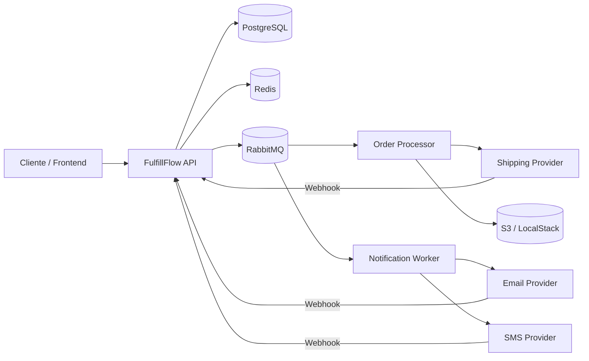
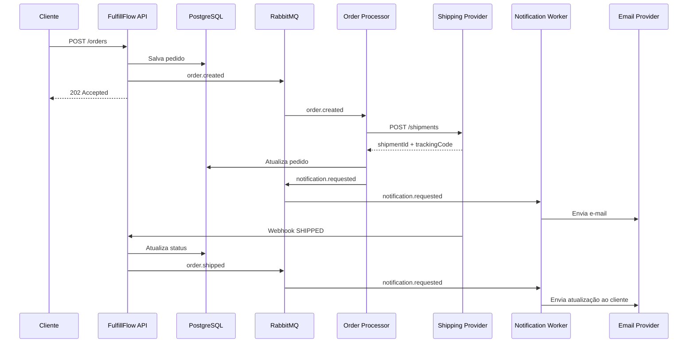

# FulfillFlow

> Projeto backend com foco em práticas próximas de produção: pedidos, integrações externas, mensageria, webhooks, notificações, Redis, S3, Docker, testes e CI/CD.

## Visão geral

O **FulfillFlow** é uma plataforma de processamento e acompanhamento de pedidos que simula problemas encontrados em sistemas reais.

O projeto nasce da combinação de dois domínios:

- **Order Flow:** criação, processamento, envio e acompanhamento de pedidos.
- **Notification Hub:** envio assíncrono de notificações por e-mail, SMS e webhook.

A ideia não é criar um sistema enorme ou uma arquitetura distribuída desnecessariamente complexa. O objetivo é construir um projeto de nível júnior com **cara de produção**, no qual cada tecnologia exista para resolver um problema real.

---

## Objetivos de aprendizado

Ao concluir o projeto, o desenvolvedor deverá ter praticado:

- criação de APIs REST;
- modelagem com PostgreSQL;
- migrations;
- validação de dados;
- tratamento global de erros;
- integração com APIs externas;
- timeout, retry e circuit breaker;
- mensageria com RabbitMQ;
- processamento assíncrono;
- Dead Letter Queue;
- webhooks;
- idempotência;
- Redis;
- armazenamento de arquivos em S3;
- presigned URLs;
- envio real de e-mails;
- envio opcional de SMS;
- logs estruturados;
- correlation ID;
- testes unitários e de integração;
- Testcontainers;
- Docker e Docker Compose;
- CI com GitHub Actions;
- documentação com Swagger/OpenAPI.

---

# Arquitetura

O projeto deve começar como um **monólito modular**.

Isso mantém o escopo controlado e permite aprender separação de responsabilidades sem adicionar a complexidade operacional de vários microsserviços.

```text
Client
   |
   v
FulfillFlow API
   |
   +-------------------+
   |                   |
   v                   v
PostgreSQL           Redis
   |
   |
   +-------> RabbitMQ
                |
        +-------+---------+
        |                 |
        v                 v
 Order Processor   Notification Worker
        |                 |
        |                 +------> Email Provider
        |                 |
        |                 +------> SMS Provider
        |
        +------> Shipping Provider
        |
        +------> S3 / LocalStack
```

O **Shipping Provider** pode ser uma aplicação separada e simples, criada apenas para simular uma empresa externa.

---

## Diagrama de componentes



---

# Fluxo principal

O fluxo básico do sistema será:

```text
1. Cliente cria um pedido
2. API valida e persiste o pedido
3. API publica order.created
4. Worker consome o evento
5. Worker cria o envio na transportadora
6. Sistema registra o tracking
7. Sistema solicita uma notificação
8. Notification Worker envia o e-mail
9. Transportadora atualiza o pedido por webhook
10. Sistema publica novos eventos
11. Cliente recebe novas notificações
```

---

## Exemplo de fluxo



---

# Stack sugerida

## Backend

- Java 21
- Spring Boot
- Spring Web
- Spring Data JPA
- Spring Validation
- Spring AMQP
- Spring Actuator

## Dados

- PostgreSQL
- Redis
- Flyway

## Mensageria

- RabbitMQ

## Integrações e resiliência

- OpenFeign ou RestClient
- Resilience4j

## Cloud

- AWS SDK v2
- S3
- LocalStack

## Qualidade

- JUnit
- Mockito
- Testcontainers

## DevOps

- Docker
- Docker Compose
- GitHub Actions

## Documentação

- Swagger
- OpenAPI

## Providers opcionais

- Resend ou outro provider transacional de e-mail
- Twilio ou outro provider de SMS

---

# Estrutura sugerida

```text
src/main/java/com/fulfillflow

├── customer
│   ├── application
│   ├── domain
│   └── infrastructure
│
├── order
│   ├── application
│   ├── domain
│   └── infrastructure
│
├── shipping
│   ├── application
│   ├── domain
│   └── infrastructure
│
├── notification
│   ├── application
│   ├── domain
│   └── infrastructure
│
├── storage
├── messaging
├── webhook
├── integration
└── shared
```

A estrutura não precisa seguir Clean Architecture de forma rígida.

O objetivo é manter:

- responsabilidades claras;
- regras de negócio separadas de infraestrutura;
- integrações externas isoladas;
- código fácil de testar.

---

# Domínio

## Customer

Representa o cliente responsável pelo pedido.

Campos sugeridos:

```text
id
name
email
phone
createdAt
```

---

## Order

Representa o pedido.

Campos sugeridos:

```text
id
customerId
status
total
createdAt
updatedAt
```

### Status

```text
CREATED
PROCESSING
READY_TO_SHIP
SHIPPED
DELIVERED
CANCELLED
FAILED
```

---

## OrderItem

```text
id
orderId
sku
productName
quantity
unitPrice
```

---

## Shipment

```text
id
orderId
providerShipmentId
trackingCode
status
createdAt
updatedAt
```

---

## Notification

```text
id
customerId
orderId
channel
recipient
template
status
provider
providerMessageId
createdAt
sentAt
deliveredAt
```

### Status

```text
PENDING
QUEUED
PROCESSING
SENT
DELIVERED
RETRYING
FAILED
```

---

# Endpoints

## Customers

```http
POST /customers
GET  /customers/{id}
```

---

## Orders

```http
POST /orders
GET  /orders
GET  /orders/{id}
GET  /orders/{id}/timeline
```

Filtros sugeridos:

```text
status
customerId
createdFrom
createdTo
```

---

## Documentos

```http
POST /orders/{id}/documents
GET  /orders/{id}/documents
```

---

## Notifications

```http
GET  /notifications/{id}
GET  /notifications/{id}/attempts
GET  /notifications?status=FAILED
POST /notifications/{id}/retry
```

---

## Webhooks

```http
POST /webhooks/shipping
POST /webhooks/email
POST /webhooks/sms
```

---

# Exemplo de criação de pedido

```http
POST /orders
Content-Type: application/json
```

```json
{
  "customerId": "1d40d67c-7ef0-4cdc-91e3-bf064eb91ddd",
  "items": [
    {
      "sku": "KEYBOARD-001",
      "productName": "Teclado Mecânico",
      "quantity": 1,
      "unitPrice": 399.90
    }
  ],
  "shippingAddress": {
    "zipCode": "06454-000",
    "number": "100"
  }
}
```

Resposta:

```json
{
  "id": "ord_b91c",
  "status": "CREATED",
  "total": 399.90
}
```

---

# Integração externa

O projeto deverá possuir pelo menos duas integrações HTTP.

## Consulta de endereço

Pode ser usada uma API pública de CEP.

Fluxo:

```text
Order API
   |
   v
Address Provider
```

O objetivo é praticar:

- DTOs de integração;
- mapeamento de respostas;
- timeout;
- erros 4xx;
- erros 5xx;
- fallback quando necessário.

---

## Shipping Provider

Será criado um provider simulado para representar uma transportadora.

Endpoints:

```http
POST /shipments
GET  /shipments/{id}
```

Exemplo:

```json
{
  "orderId": "ord_b91c",
  "destinationZipCode": "06454-000"
}
```

Resposta:

```json
{
  "shipmentId": "SHIP-91827",
  "trackingCode": "BR918272",
  "status": "CREATED"
}
```

---

# Shipping Provider Simulator

O repositório pode possuir uma segunda aplicação pequena:

```text
shipping-provider
```

Ela terá endpoints administrativos para simular problemas.

```http
POST /admin/failure-rate
POST /admin/delay
POST /admin/dispatch-webhook
```

Exemplo:

```json
{
  "failureRate": 50,
  "delayMs": 3000
}
```

Isso permite testar:

- timeout;
- retry;
- circuit breaker;
- indisponibilidade;
- respostas 500;
- respostas lentas.

---

# Mensageria

Eventos sugeridos:

```text
order.created
order.processing
order.shipped
order.delivered
order.cancelled

notification.requested
notification.sent
notification.failed
```

---

## Fluxo

```text
POST /orders
     |
     v
order.created
     |
     v
Order Processor
```

Quando o pedido for enviado:

```text
order.shipped
     |
     v
Notification Worker
     |
     v
EMAIL / SMS
```

---

# RabbitMQ

Estrutura inicial:

```text
Exchange:
fulfillflow.events

Queues:
order.processing
notification.email
notification.sms

DLQs:
order.processing.dlq
notification.dlq
```

---

# Retry e Dead Letter Queue

Falhas transitórias devem ser tratadas com retry.

Exemplo:

```text
notification.requested
        |
        v
Notification Worker
        |
        v
Email Provider
        |
       503
        |
        v
Retry #1
        |
       503
        |
        v
Retry #2
        |
       503
        |
        v
DLQ
```

Erros permanentes não devem entrar em retry infinito.

Exemplo:

```text
HTTP 400
destinatário inválido
template inexistente
```

---

# Notification Hub

O módulo de notificações deverá abstrair os providers.

```java
public interface NotificationProvider {

    Channel channel();

    SendResult send(NotificationMessage message);
}
```

Implementações:

```text
ResendEmailProvider
TwilioSmsProvider

FakeEmailProvider
FakeSmsProvider
```

---

## Estratégias

### ALL

Envia por todos os canais solicitados.

```text
EMAIL + SMS
```

### FALLBACK

Tenta um canal e usa outro em caso de falha permanente.

```text
SMS
 |
 FAIL
 |
 v
EMAIL
```

Essa feature pode ser considerada bônus.

---

# Templates

Exemplo:

```text
ORDER_CREATED
```

```text
Assunto:
Pedido {{orderId}} recebido

Mensagem:
Olá {{name}}, recebemos o seu pedido {{orderId}}.
```

Outro exemplo:

```text
ORDER_SHIPPED
```

```text
Seu pedido {{orderId}} foi enviado.

Código de rastreio:
{{trackingCode}}
```

---

# Webhooks

A transportadora poderá enviar:

```http
POST /webhooks/shipping
```

```json
{
  "eventId": "evt-19281",
  "shipmentId": "SHIP-91827",
  "status": "SHIPPED"
}
```

O sistema deverá:

```text
1. validar assinatura;
2. verificar se o evento já foi processado;
3. atualizar o shipment;
4. atualizar o pedido;
5. registrar evento na timeline;
6. publicar order.shipped;
7. retornar HTTP 200.
```

---

# Idempotência

Webhooks e mensagens podem chegar mais de uma vez.

O sistema precisa ser capaz de receber:

```text
evt-91827
evt-91827
evt-91827
```

e produzir apenas um efeito de negócio.

Uma estratégia possível:

```text
Redis
```

Chave:

```text
webhook:shipping:evt-91827
```

Fluxo:

```text
Evento recebido
      |
      v
Existe no Redis?
   /       \
 sim       não
 |          |
ignora    processa
            |
            v
       salva chave
```

---

## Idempotency-Key

A criação de uma notificação também pode aceitar:

```http
Idempotency-Key: 7c07c52d-9db0-49aa-9ea4
```

Se o cliente repetir a chamada:

```text
Request #1 -> cria not_123
Request #2 -> retorna not_123
Request #3 -> retorna not_123
```

---

# Redis

Redis pode ser utilizado para:

- idempotência;
- rate limiting;
- cache de consultas externas;
- contadores temporários.

Exemplo de rate limit:

```text
máximo de 5 SMS por minuto por usuário
```

---

# S3

O projeto deverá armazenar documentos relacionados ao pedido.

Exemplos:

- etiqueta de envio;
- comprovante;
- invoice;
- recibo.

Em ambiente local:

```text
LocalStack
```

Em produção:

```text
AWS S3
```

---

## Fluxo

```text
Order Processor
      |
      v
AWS SDK
      |
      v
S3
```

No banco, deve ser armazenada apenas a chave do objeto.

Exemplo:

```text
orders/ord_b91c/shipping-label.pdf
```

---

## Presigned URL

O endpoint:

```http
GET /orders/{id}/documents
```

pode retornar:

```json
[
  {
    "type": "SHIPPING_LABEL",
    "url": "https://presigned-url..."
  }
]
```

---

# Timeline do pedido

Endpoint:

```http
GET /orders/{id}/timeline
```

Exemplo:

```json
[
  {
    "event": "ORDER_CREATED",
    "occurredAt": "2026-10-01T12:30:00Z"
  },
  {
    "event": "SHIPMENT_CREATED",
    "occurredAt": "2026-10-01T12:31:21Z"
  },
  {
    "event": "EMAIL_SENT",
    "occurredAt": "2026-10-01T12:31:25Z"
  },
  {
    "event": "ORDER_SHIPPED",
    "occurredAt": "2026-10-02T10:11:21Z"
  }
]
```

A timeline ajuda a praticar:

- auditoria;
- rastreabilidade;
- eventos de domínio;
- debugging.

---

# Observabilidade

Toda requisição deverá possuir um identificador.

Exemplo:

```text
X-Correlation-Id
```

Esse identificador deve aparecer em:

```text
HTTP request
    |
    v
order.created
    |
    v
consumer
    |
    v
shipping request
    |
    v
notification
```

Assim é possível rastrear o fluxo completo.

---

## Logs

Exemplo:

```text
INFO correlationId=abc123 orderId=ord_918 order.created
INFO correlationId=abc123 orderId=ord_918 shipment.created
INFO correlationId=abc123 notificationId=not_128 email.sent
```

---

# Health Check

A aplicação deverá expor:

```http
GET /actuator/health
```

Verificando, quando possível:

- PostgreSQL;
- Redis;
- RabbitMQ;
- S3.

---

# Testes

## Unitários

Usar para:

- regras de negócio;
- cálculo do pedido;
- validações;
- templates;
- estratégias de notificação.

---

## Integração

Usar Testcontainers para subir:

```text
PostgreSQL
RabbitMQ
Redis
```

Quando necessário:

```text
LocalStack
```

---

## Cenários importantes

### Pedido

```text
Criar pedido válido
-> pedido salvo
-> evento publicado
```

### Provider indisponível

```text
Shipping Provider retorna 500
-> retry
-> falha persistente
-> DLQ
```

### Webhook duplicado

```text
mesmo eventId enviado três vezes
-> efeito processado apenas uma vez
```

### Notificação

```text
provider retorna 503
-> retry
-> sucesso
```

### Notificação permanentemente inválida

```text
provider retorna 400
-> FAILED
-> sem loop infinito
```

### S3

```text
upload válido
-> arquivo no bucket
-> metadata no banco
```

---

# Docker

Toda a infraestrutura local deverá ser executável com:

```bash
docker compose up -d
```

Serviços sugeridos:

```text
fulfillflow-api
shipping-provider
postgres
rabbitmq
redis
localstack
```

---

# Variáveis de ambiente

Exemplo de `.env.example`:

```env
POSTGRES_DB=fulfillflow
POSTGRES_USER=fulfillflow
POSTGRES_PASSWORD=fulfillflow

SPRING_RABBITMQ_HOST=rabbitmq
SPRING_DATA_REDIS_HOST=redis

AWS_REGION=us-east-1
AWS_ACCESS_KEY_ID=test
AWS_SECRET_ACCESS_KEY=test

S3_BUCKET=fulfillflow-documents

EMAIL_PROVIDER_API_KEY=

SMS_PROVIDER_ACCOUNT=
SMS_PROVIDER_TOKEN=
```

Nunca versionar secrets reais.

---

# CI

O GitHub Actions deverá executar:

```text
checkout
   |
   v
setup Java
   |
   v
build
   |
   v
unit tests
   |
   v
integration tests
```

Opcionalmente:

```text
docker build
```

---

# Roadmap

O projeto foi pensado para aproximadamente **8 semanas**.

---

## Semana 1 — Fundação

Implementar:

- projeto Spring Boot;
- PostgreSQL;
- Docker;
- Flyway;
- Customer;
- Order;
- OrderItem.

Objetivo:

> possuir o primeiro fluxo persistido funcionando.

---

## Semana 2 — API

Implementar:

```http
POST /customers
POST /orders
GET /orders
GET /orders/{id}
```

Adicionar:

- validação;
- tratamento de erros;
- paginação;
- filtros;
- Swagger.

---

## Semana 3 — Integrações HTTP

Adicionar:

- consulta de CEP;
- Shipping Provider;
- HTTP client;
- timeouts;
- tratamento de erros;
- Resilience4j.

---

## Semana 4 — Mensageria

Adicionar:

```text
RabbitMQ
order.created
Order Processor
retry
DLQ
```

Transformar parte do processamento em assíncrono.

---

## Semana 5 — Notification Hub

Adicionar:

- Notification;
- NotificationAttempt;
- notification.requested;
- Notification Worker;
- e-mail;
- templates.

Objetivo:

> receber um e-mail real ao criar ou atualizar um pedido.

---

## Semana 6 — Webhooks e Redis

Adicionar:

- webhook de shipping;
- webhook de e-mail;
- assinatura;
- idempotência;
- Redis;
- rate limiting simples.

---

## Semana 7 — S3 e testes

Adicionar:

- LocalStack;
- S3;
- upload;
- presigned URL;
- Testcontainers;
- testes de integração.

---

## Semana 8 — Produção-like

Adicionar:

- correlation ID;
- logs estruturados;
- health checks;
- métricas básicas;
- GitHub Actions;
- documentação;
- diagramas;
- revisão de código.

---

# Backlog sugerido

| Ticket | Descrição |
|---|---|
| FF-001 | Criar projeto Spring Boot |
| FF-005 | Configurar PostgreSQL e Flyway |
| FF-009 | Implementar cadastro de clientes |
| FF-013 | Implementar criação de pedidos |
| FF-017 | Adicionar paginação e filtros |
| FF-021 | Integrar com API de CEP |
| FF-025 | Criar Shipping Provider Simulator |
| FF-029 | Integrar com transportadora |
| FF-033 | Adicionar timeout e retry |
| FF-037 | Configurar RabbitMQ |
| FF-041 | Publicar `order.created` |
| FF-045 | Criar Order Processor |
| FF-049 | Configurar DLQ |
| FF-053 | Criar módulo Notification |
| FF-057 | Criar `NotificationProvider` |
| FF-061 | Implementar envio de e-mail |
| FF-065 | Criar templates |
| FF-069 | Receber webhook de shipping |
| FF-073 | Implementar idempotência |
| FF-077 | Adicionar Redis |
| FF-081 | Implementar rate limit |
| FF-085 | Integrar com S3 |
| FF-089 | Criar presigned URL |
| FF-093 | Implementar timeline |
| FF-097 | Adicionar correlation ID |
| FF-101 | Adicionar Testcontainers |
| FF-105 | Criar pipeline CI |
| FF-109 | Documentar arquitetura |
| FF-113 | Adicionar SMS como feature bônus |

---

# Definition of Done

O projeto poderá ser considerado concluído quando:

- `docker compose up` subir toda a infraestrutura;
- for possível criar um pedido;
- `order.created` for publicado;
- um consumer processar o pedido;
- o sistema conversar com o Shipping Provider;
- o pedido possuir tracking;
- um e-mail real puder ser enviado;
- o sistema receber webhooks;
- webhooks duplicados não gerarem efeitos duplicados;
- mensagens com falha persistente chegarem à DLQ;
- documentos forem armazenados no S3;
- uma presigned URL puder ser gerada;
- os principais fluxos possuírem testes de integração;
- o CI executar build e testes;
- o README explicar arquitetura e decisões técnicas.

---

# Cenários de falha que devem ser demonstráveis

O projeto deve permitir simular:

```text
Shipping Provider fora do ar
Shipping Provider lento
HTTP 500
HTTP 400
RabbitMQ indisponível
mensagem duplicada
webhook duplicado
e-mail falhando
S3 indisponível
```

O objetivo não é apenas fazer o happy path funcionar.

---

# Perguntas que o desenvolvedor deve conseguir responder

Ao final do projeto, o desenvolvedor deve conseguir explicar:

1. Por que utilizar mensageria nesse fluxo?
2. Por que não executar tudo dentro do `POST /orders`?
3. Qual a diferença entre uma chamada síncrona e assíncrona?
4. O que acontece se o consumer falhar?
5. Quando uma mensagem deve ir para a DLQ?
6. O que é idempotência?
7. Por que webhooks precisam ser idempotentes?
8. Como evitar envio duplicado de e-mail?
9. Quando usar retry?
10. Quando não usar retry?
11. Para que serve um circuit breaker?
12. Qual o papel do Redis no projeto?
13. Por que armazenar arquivos no S3 em vez do banco?
14. O que é uma presigned URL?
15. Como rastrear uma requisição entre vários componentes?
16. Como testar integrações sem depender de serviços externos?
17. Como trocar um provider de e-mail sem alterar as regras de negócio?
18. Quais partes você separaria em microsserviços caso o sistema crescesse?

---

# O que não faz parte do MVP

Para manter o projeto realizável em 1–2 meses, não é necessário adicionar:

- Kubernetes;
- Terraform;
- Event Sourcing;
- CQRS;
- Kafka;
- múltiplos microsserviços;
- Service Mesh;
- API Gateway;
- autenticação complexa;
- observabilidade distribuída completa.

Esses itens podem ser explorados posteriormente.

---

# Features bônus

Depois do MVP:

- autenticação com JWT;
- OpenTelemetry;
- tracing distribuído;
- dashboard React;
- SMS real;
- estratégia de fallback entre canais;
- rate limit avançado;
- Outbox Pattern;
- reprocessamento manual de DLQ;
- métricas com Prometheus;
- dashboards no Grafana;
- deploy na AWS;
- Terraform;
- integração com WhatsApp;
- feature flags.

---

# Possível evolução

Quando o sistema crescer, uma evolução possível seria:

```text
Order Service
Shipping Service
Notification Service
```

Mas a decisão de separar serviços deve acontecer apenas quando existir um motivo real.

Exemplos:

- necessidade de escalar módulos separadamente;
- times diferentes;
- ciclos de deploy independentes;
- requisitos de disponibilidade distintos;
- volume muito diferente entre domínios.

O projeto deve começar como **monólito modular**.

---

# Critério principal

O objetivo não é ter o maior número de tecnologias possível.

O objetivo é construir um backend pequeno, confiável e explicável, em que cada tecnologia resolve um problema concreto.

> Um projeto de portfólio forte não é aquele que possui a arquitetura mais complexa.  
> É aquele em que o desenvolvedor consegue explicar claramente as decisões, os trade-offs e como o sistema se comporta quando algo dá errado.
